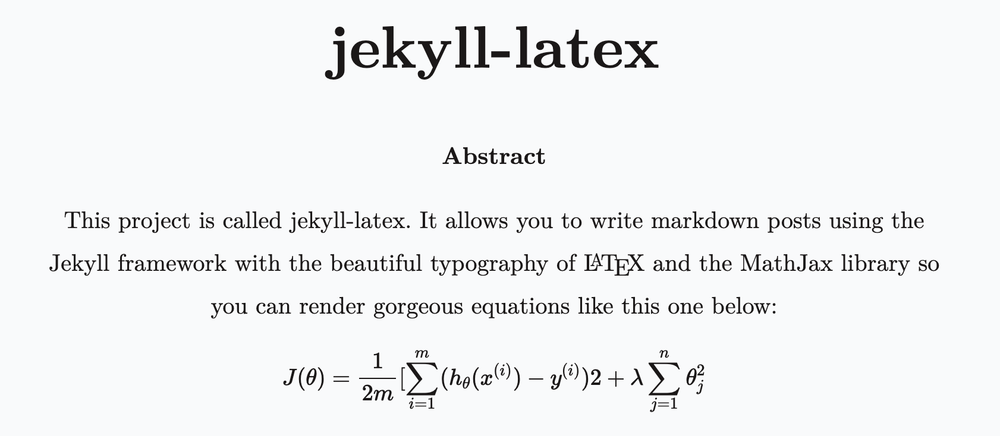

# jekyll-latex

<p align="center">
    
</p>

  [](LICENSE.md) 


## Features
- LaTeX typography
- Abstract, theorems, proofs, and definitions
- MathJax
- Google Analytics
- Profile photo
- Compatible with Jekyll 3.x and Github Pages
- Responsive layout
- Supports Jekyll's SCSS preprocessor

## Installation
```
git clone https://github.com/mtouzot/jekyll-latex.git

bundle install

# Change all relevant settings for your site in _config.yml

bundle exec jekyll serve --watch
```

## Credits

Based on the amazing work below:
- https://github.com/ryanmcdermott/jekyll-latex
- https://github.com/heiswayi/the-plain
- https://github.com/vincentdoerig/latex-css

## Licenses

1. This project: MIT
1. The Plain (of which this is based): MIT
1. Latex CSS: MIT